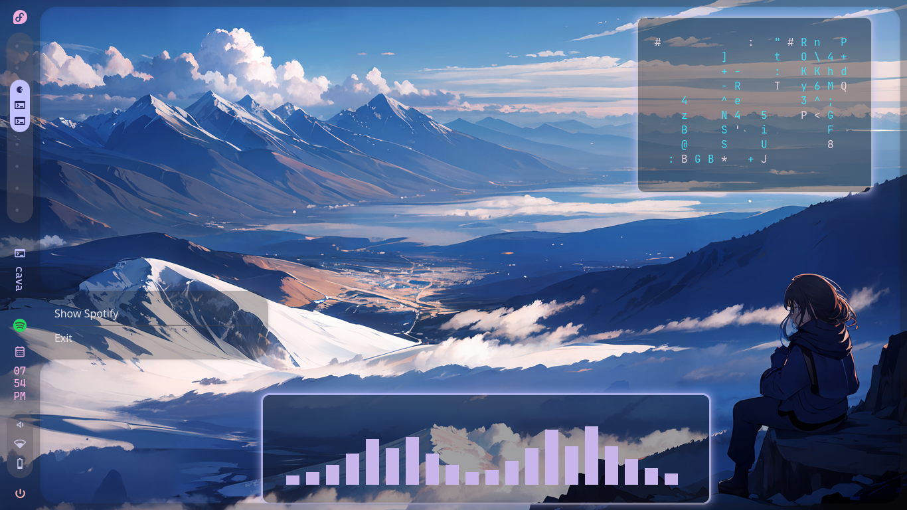
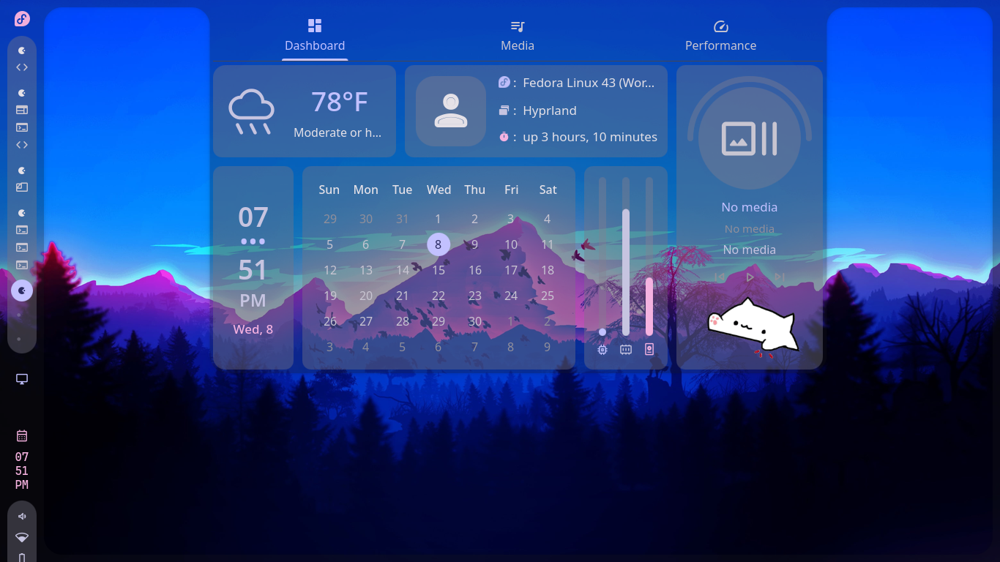
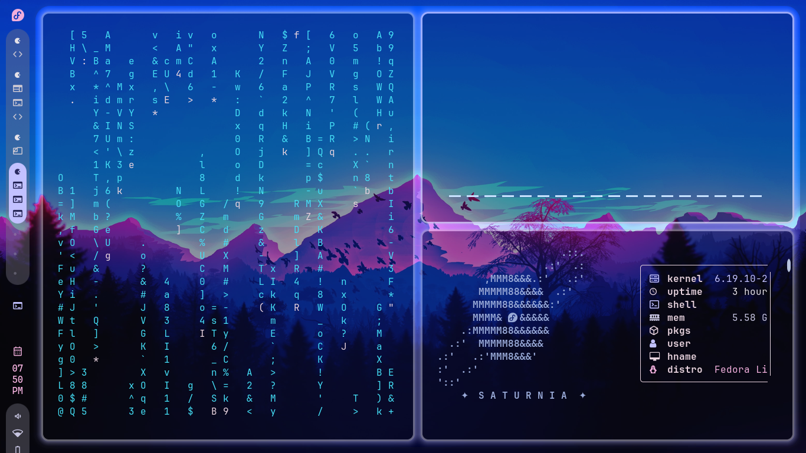

<div align="center">
  <h1>🌌 Caelestia Fedora Dotfiles</h1>
  <p>Complete Hyprland configuration for Fedora Linux with Material 3 dynamic theming</p>

  [](https://fedoraproject.org/)
  [](https://hyprland.org/)
  [](https://wayland.freedesktop.org/)
</div>

---

## 📸 Screenshots

| Desktop | Dashboard | Terminal |
|---------|-----------|----------|
|  |  |  |

---

## ✨ Features

- **Dynamic Colors** — Material 3 theme auto-follows wallpaper (smartMode)
- **Wallpaper** — Waypaper + swww with smooth animations (grow, wave, fade)
- **Terminal** — Foot with 16 auto-updated colors from wallpaper
- **Shell** — Fish + Starship prompt with custom aliases
- **Launcher** — Rofi application launcher
- **System Info** — Fastfetch with custom Saturn logo
- **Monitor** — Btop with Caelestia theme

---

---

## ⌨️ Key Bindings

| Keybind | Action |
|---------|--------|
| `Super` | App launcher |
| `Super + T` | Terminal |
| `Super + Q` | Close window |
| `Super + F` | Fullscreen |
| `Super + Space` | Toggle floating |
| `Super + W` | Random wallpaper |
| `Super + Shift + W` | Wallpaper picker |
| `Super + Shift + L` | Lock screen |
| `Super + 1-9` | Switch workspace |
| `Super + Shift + 1-9` | Move window to workspace |
| `Print` | Screenshot to clipboard |
| `Super + Shift + S` | Region screenshot |

---

## 📁 Structure

```
dotfiles/
├── .config/
│   ├── hypr/          # Hyprland (hyprland.conf, keybinds.conf, decoration.conf...)
│   ├── foot/          # Terminal
│   ├── fish/          # Shell
│   ├── fastfetch/     # System info
│   ├── waypaper/      # Wallpaper manager
│   ├── btop/          # Process monitor
│   ├── rofi/          # App launcher
│   └── quickshell/    # Caelestia shell (QML)
├── .local/bin/        # Scripts: update-borders, update-terminal, rofi-wallpaper
└── README.md
```

---

## 🤝 Credits

[Caelestia](https://github.com/EnceladusII/caelestia-fedora) · [Hyprland](https://hyprland.org/) · [Waypaper](https://github.com/anufrievroman/waypaper) · [Swww](https://github.com/Horus645/swww) · [Foot](https://codeberg.org/dnkl/foot) · [Fish](https://fishshell.com/) · [Fastfetch](https://github.com/fastfetch-cli/fastfetch)

---

<div align="center"><sub>Made with 🧡 on Fedora Linux · MIT License</sub></div>
